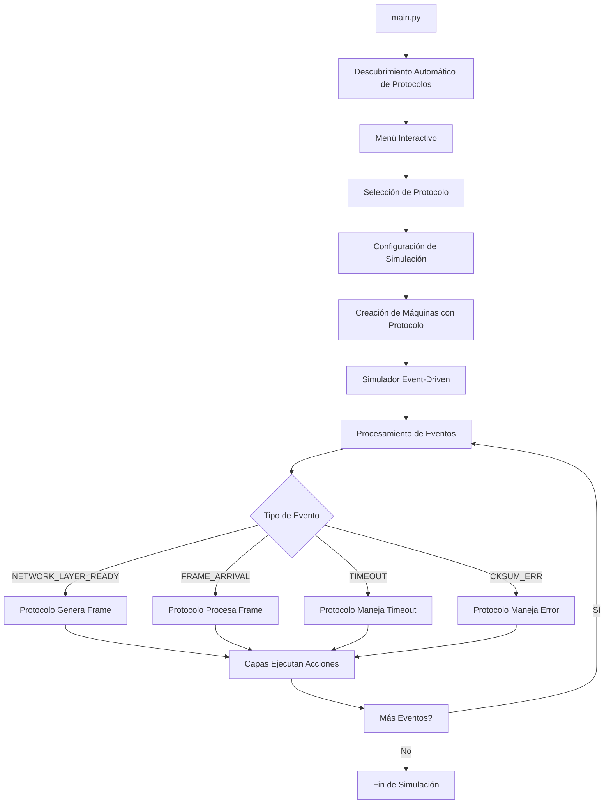
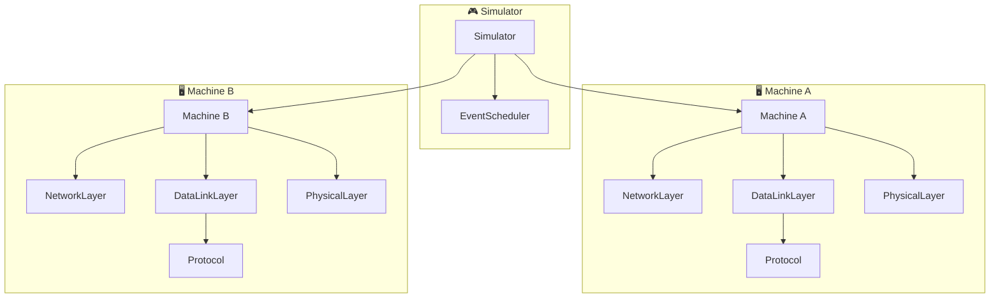
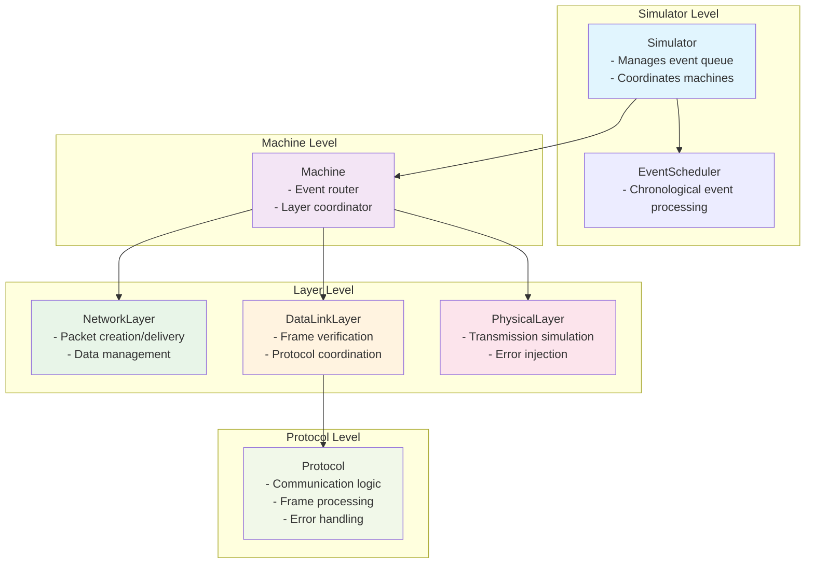

# 🌐 Simulador de Protocolos de Red - Versión Modular

Simulador educativo avanzado que implementa múltiples protocolos de comunicación de red usando una arquitectura modular. Simula la comunicación entre máquinas a través de una red con errores controlados, demostrando diferentes estrategias de confiabilidad.

## 🚀 Protocolos Implementados

### 1. **Utopia Protocol**
- Protocolo ideal sin errores ni pérdidas
- Transmisión directa sin control de errores
- Caso de estudio para comparación

### 2. **PAR (Positive Acknowledgment with Retransmission)**
- Confirmación positiva con retransmisión
- Manejo básico de errores y timeouts
- ACKs explícitos para cada frame

### 3. **Stop and Wait**
- Un frame a la vez con confirmación
- Espera ACK antes del siguiente envío
- Control de flujo simple

### 4. **Selective Repeat (Bidireccional)**
- **Ventana deslizante configurable** (por defecto N=4)
- **Comunicación bidireccional** completa
- **Retransmisión selectiva** de frames perdidos
- **Timeouts individuales** por frame
- **ACKs selectivos** para eficiencia máxima

## 🎯 Ejecución Rápida

```bash
python3 main.py
```

El simulador detecta automáticamente todos los protocolos disponibles y presenta un menú interactivo para seleccionar y configurar la simulación.

## 🏗️ Arquitectura Modular

### Estructura del Proyecto
```
network_simulator/
├── main.py                    # 🎯 Punto de entrada modular
├── protocols/                 # 🔧 Protocolos de comunicación
│   ├── __init__.py
│   ├── protocol_interface.py  # 📋 Interfaz base para todos los protocolos
│   ├── utopia.py             # ✨ Protocolo ideal
│   ├── par.py                # 🔄 Positive ACK with Retransmission
│   ├── stop_and_wait.py      # ⏸️ Stop and Wait
│   └── selective_repeat.py   # 🎯 Selective Repeat bidireccional
├── layers/                   # 🌐 Capas de red
│   ├── network_layer.py      # 📊 Capa de red
│   ├── data_link_layer.py    # 📦 Capa de enlace (protocolo-agnóstica)
│   └── physical_layer.py     # ⚡ Capa física (errores y delays)
├── models/                   # 📋 Modelos de datos
│   ├── events.py            # 📅 Eventos del simulador
│   ├── frame.py             # 📨 Estructura de frames
│   └── packet.py            # 📦 Estructura de paquetes
└── simulation/              # ⚙️ Motor de simulación
    ├── simulator.py         # 🎮 Simulador principal
    ├── machine.py          # 🖥️ Máquina coordinadora
    └── event_scheduler.py  # ⏰ Programador de eventos
```

### 🔄 Flujo de Arquitectura Modular



### 🧩 Interfaz de Protocolos

Todos los protocolos implementan la misma interfaz estándar:

```python
class ProtocolInterface:
    def handle_network_layer_ready(self, packet) -> ProtocolResponse
    def handle_frame_arrival(self, frame) -> ProtocolResponse  
    def handle_timeout(self, timer_id=None) -> ProtocolResponse
    def handle_checksum_error(self, frame) -> ProtocolResponse
```

### ⚡ Sistema de Eventos

El simulador procesa eventos cronológicamente:
- **`NETWORK_LAYER_READY`**: Datos listos para enviar
- **`FRAME_ARRIVAL`**: Frame válido recibido
- **`CKSUM_ERR`**: Frame corrupto detectado
- **`TIMEOUT`**: Timeout de retransmisión
- **`SEND_FRAME`**: Envío físico de frame

### 4. Lo Que Ves en Pantalla

```
--- Tiempo: 0.10s | Evento #1 ---
[A] Procesando: Event(network_layer_ready, t=0.10, machine=A)
  [NetworkLayer-A] Generado: Packet(Data_A_1)
  [PhysicalLayer] Enviando Frame(DATA, packet=Data_A_1) hacia B
  [PhysicalLayer] ¡Frame corrupto durante transmisión!

--- Tiempo: 0.60s | Evento #2 ---
[B] Procesando: Event(cksum_err, t=0.60, machine=B)
[B] Frame corrupto recibido
```

## Configuración de Errores

```python
sim.set_global_error_rate(0.2)    # 20% de frames se corrompen
sim.set_error_rate("A", 0.05)     # Máquina A: solo 5% errores
```

## System Architecture



## Component Hierarchy



## 🚀 Ejemplos de Uso

### Ejecutar Simulación Básica
```bash
python3 main.py

# Seleccionar protocolo del menú interactivo
# Configurar tasas de error y delays
# Observar la comunicación en tiempo real
```

### Comparar Rendimiento de Protocolos
1. **Utopia**: Sin errores → Línea base de rendimiento
2. **PAR**: Con errores → Ver impacto de retransmisiones  
3. **Stop-and-Wait**: Eficiencia vs confiabilidad
4. **Selective Repeat**: Máximo throughput con confiabilidad

### Escenarios de Prueba Recomendados

#### 📊 Ambiente Ideal (Error Rate = 0.0)
- Todos los protocolos funcionan perfectamente
- Selective Repeat muestra su ventaja en throughput
- Latencias mínimas

#### ⚠️ Red con Errores Moderados (Error Rate = 0.1)  
- PAR y Stop-and-Wait muestran retransmisiones
- Selective Repeat mantiene mejor rendimiento
- Timeouts y recovery visibles

#### 🔥 Red Hostil (Error Rate = 0.3+)
- Protocolos simples sufren mucho
- Selective Repeat demuestra su robustez
- Múltiples retransmisiones concurrentes

## 🎯 Propósito Educativo

Este simulador modular permite entender:

### 🔧 **Protocolos de Red**
- **Confiabilidad vs Eficiencia**: Comparación directa entre protocolos
- **Manejo de Errores**: Diferentes estrategias (ignorar, retransmitir, selective repeat)
- **Control de Flujo**: Ventanas deslizantes y stop-and-wait
- **Timeouts y Recovery**: Mecanismos de recuperación automática

### 🏗️ **Arquitectura de Software**
- **Separación de Responsabilidades**: Cada capa tiene un propósito específico
- **Interfaces Consistentes**: Todos los protocolos implementan la misma API
- **Modularidad**: Fácil agregar nuevos protocolos sin modificar el resto
- **Event-Driven Programming**: Simulación basada en eventos discretos

### 🌐 **Conceptos de Redes**
- **Modelo de Capas**: Network, DataLink, Physical
- **Frames vs Packets**: Diferencias y encapsulación
- **Transmisión con Errores**: Simulación realista de medios físicos
- **Comunicación Bidireccional**: Flujos simultáneos de datos

## 🚀 Ejecutar

```bash
python3 main.py
```

**¡Disfruta explorando cómo los diferentes protocolos manejan la comunicación en redes con errores!** 🌐
