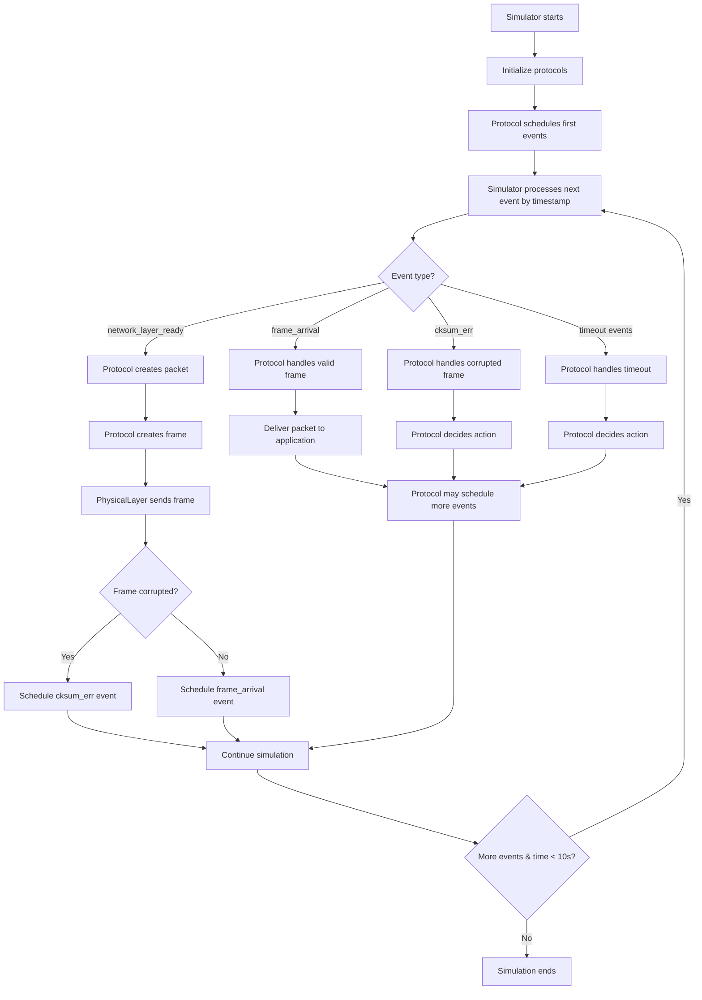
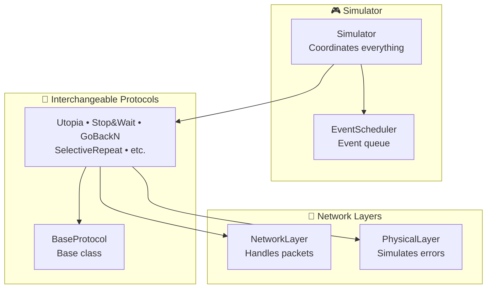

# Simulador de Protocolos de Red

Simulador educativo que muestra cómo las máquinas se comunican enviando datos a través de una red con errores.

## ¿Cómo Funciona?

### 1. Configuración Inicial
```python
python main.py
```

El programa crea:
- **Máquina A**: Emisor que envía datos
- **Máquina B**: Receptor que recibe datos
- **Simulador**: Coordina toda la comunicación

### 2. Program Flow



#### General Flow (protocol-independent):
1. **Simulator** initializes machines and their protocols
2. **Protocol** schedules initial events based on its specific logic
3. **Simulator** processes events chronologically:
   - `network_layer_ready` → protocol can send data
   - `frame_arrival` → valid frame arrived at receiver
   - `cksum_err` → corrupted frame arrived at receiver
   - `timeout` / `ack_timeout` → timeout handling (protocol-dependent)
4. **Each protocol** decides how to react to each event
5. **PhysicalLayer** always applies realistic errors and delays
6. **Process repeats** until stop condition is met

### 3. Sistema de Eventos

El simulador funciona con **eventos programados**:
- `network_layer_ready`: "Tengo datos para enviar"
- `frame_arrival`: "Llegó un frame válido"
- `cksum_err`: "Llegó un frame corrupto"

### 4. Lo Que Ves en Pantalla

```
--- Tiempo: 0.10s | Evento #1 ---
[A] Procesando: Event(network_layer_ready, t=0.10, machine=A)
  [NetworkLayer-A] Generado: Packet(Data_A_1)
  [PhysicalLayer] Enviando Frame(DATA, packet=Data_A_1) hacia B
  [PhysicalLayer] ¡Frame corrupto durante transmisión!

--- Tiempo: 0.60s | Evento #2 ---
[B] Procesando: Event(cksum_err, t=0.60, machine=B)
[B] Frame corrupto recibido
```

## Configuración de Errores

```python
sim.set_global_error_rate(0.2)    # 20% de frames se corrompen
sim.set_error_rate("A", 0.05)     # Máquina A: solo 5% errores
```

## System Architecture



## Estructura de Archivos

```
main.py           # Punto de entrada - configura y ejecuta
├── simulation/
│   ├── simulator.py      # Coordinador principal
│   └── event_scheduler.py # Cola de eventos ordenada por tiempo
├── protocols/
│   └── utopia.py         # Protocolo simple: A envía, B recibe
├── layers/
│   ├── network_layer.py  # Crea y entrega paquetes
│   └── physical_layer.py # Envía frames, simula errores
└── models/
    ├── packet.py         # Datos a enviar
    ├── frame.py          # Envoltorio del packet
    └── events.py         # Eventos del simulador
```

## ¿Para Qué Sirve?

Este simulador te ayuda a entender:
- Cómo los datos viajan por una red
- Por qué los protocolos necesitan manejar errores
- Cómo funciona la simulación por eventos discretos
- La diferencia entre paquetes y frames

## Ejecutar

```bash
python main.py
```

Verás la configuración de errores, luego el intercambio de frames en tiempo real, y finalmente las estadísticas de cuántos frames se enviaron y recibieron.
