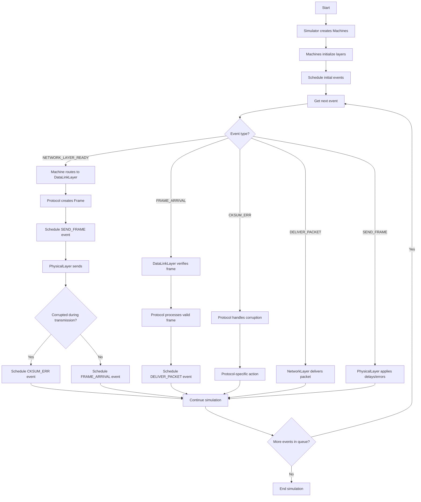
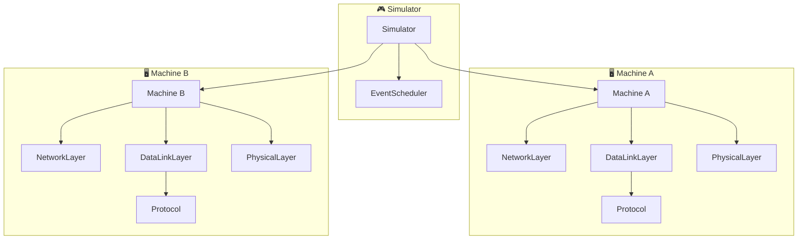
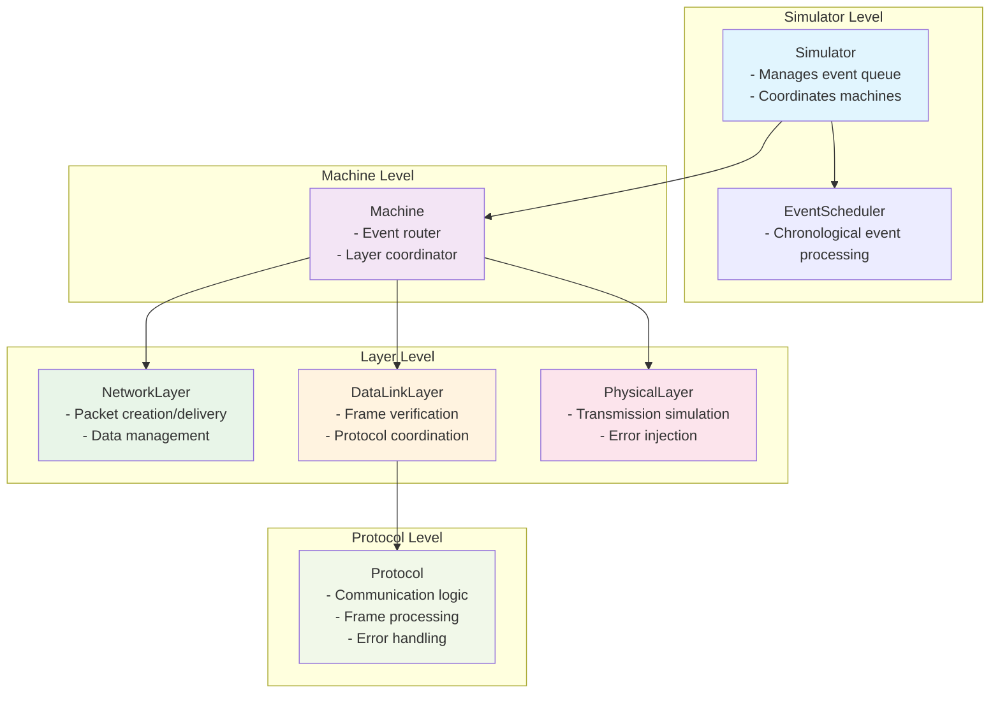

# Simulador de Protocolos de Red

Simulador educativo que muestra cómo las máquinas se comunican enviando datos a través de una red con errores, usando un modelo de capas donde cada máquina coordina NetworkLayer, DataLinkLayer y PhysicalLayer.

## ¿Cómo Funciona?

### 1. Configuración Inicial
```python
python main.py
```

El programa crea:
- **Máquina A**: Máquina emisora que envía datos
- **Máquina B**: Máquina receptora que recibe datos
- **Simulador**: Maneja eventos y coordina la comunicación entre máquinas

### 2. Program Flow



#### General Flow (protocol-independent):
1. **Simulator** creates machines and initializes their layers
2. **EventScheduler** manages chronological event processing
3. **Event types and their usage**:
   - `NETWORK_LAYER_READY` → Machine has data to send, routes to DataLinkLayer
   - `FRAME_ARRIVAL` → Valid frame received, DataLinkLayer processes with Protocol
   - `CKSUM_ERR` → Corrupted frame received, Protocol handles error
   - `DELIVER_PACKET` → Packet ready for delivery to NetworkLayer
   - `SEND_FRAME` → Frame ready for transmission via PhysicalLayer
4. **Machine** acts as event router, delegating to appropriate layers
5. **DataLinkLayer** coordinates with Protocol for communication logic
6. **PhysicalLayer** applies realistic transmission delays and errors
7. **Process repeats** until event queue is empty

### 3. Sistema de Eventos

El simulador funciona con **eventos programados**:
- `network_layer_ready`: "Tengo datos para enviar"
- `frame_arrival`: "Llegó un frame válido"
- `cksum_err`: "Llegó un frame corrupto"

### 4. Lo Que Ves en Pantalla

```
--- Tiempo: 0.10s | Evento #1 ---
[A] Procesando: Event(network_layer_ready, t=0.10, machine=A)
  [NetworkLayer-A] Generado: Packet(Data_A_1)
  [PhysicalLayer] Enviando Frame(DATA, packet=Data_A_1) hacia B
  [PhysicalLayer] ¡Frame corrupto durante transmisión!

--- Tiempo: 0.60s | Evento #2 ---
[B] Procesando: Event(cksum_err, t=0.60, machine=B)
[B] Frame corrupto recibido
```

## Configuración de Errores

```python
sim.set_global_error_rate(0.2)    # 20% de frames se corrompen
sim.set_error_rate("A", 0.05)     # Máquina A: solo 5% errores
```

## System Architecture



## Component Hierarchy



## Estructura de Archivos

```
main.py                    # Punto de entrada - configura y ejecuta simulación
├── simulation/
│   ├── simulator.py       # Coordinador principal del simulador
│   ├── machine.py         # Máquina que coordina todas las capas
│   └── event_scheduler.py # Cola de eventos ordenada por tiempo
├── protocols/
│   └── utopia.py          # Protocolo simple sin control de errores
├── layers/
│   ├── network_layer.py   # Crea y entrega paquetes
│   ├── data_link_layer.py # Coordina con protocolos y verifica frames
│   └── physical_layer.py  # Transmisión con errores y retardos realistas
└── models/
    ├── packet.py          # Datos a transmitir
    ├── frame.py           # Envoltorio del packet con metadatos
    └── events.py          # Tipos de eventos del simulador
```

## Relaciones de Componentes

### ¿Quién Contiene a Quién?

- **Simulator** ←→ contiene múltiples **Machines**
- **Machine** ←→ administra **NetworkLayer**, **DataLinkLayer**, **PhysicalLayer**
- **DataLinkLayer** ←→ contiene un **Protocol** específico
- **NetworkLayer** ←→ crea y maneja **Packets**
- **DataLinkLayer + Protocol** ←→ crean y procesan **Frames**
- **PhysicalLayer** ←→ transmite **Frames** con errores/retardos
- **EventScheduler** ←→ maneja cola de **Events**

### Flujo de Responsabilidades

1. **Simulator** coordina todo y maneja eventos
2. **Machine** actúa como router de eventos hacia sus capas
3. **DataLinkLayer** delega decisiones al **Protocol**
4. **Protocol** decide toda la lógica de comunicación
5. **PhysicalLayer** aplica condiciones realistas de red

## ¿Para Qué Sirve?

Este simulador te ayuda a entender:
- Cómo las máquinas coordinan múltiples capas de red
- Por qué los protocolos necesitan manejar errores y eventos
- Cómo funciona la simulación por eventos discretos
- La diferencia entre paquetes y frames
- Cómo se delegan responsabilidades entre capas

## Ejecutar

```bash
python main.py
```

Verás la configuración de errores, luego el intercambio de frames en tiempo real, y finalmente las estadísticas de cuántos frames se enviaron y recibieron.
