# Simulador de Protocolos de Red

Simulador educativo que muestra cómo las máquinas se comunican enviando datos a través de una red con errores.

## ¿Cómo Funciona?

### 1. Configuración Inicial
```python
python main.py
```

El programa crea:
- **Máquina A**: Emisor que envía datos
- **Máquina B**: Receptor que recibe datos
- **Simulador**: Coordina toda la comunicación

### 2. Flujo del Programa

```mermaid
flowchart TD
    A[Máquina A inicia protocolo] --> B[NetworkLayer crea packet]
    B --> C[Protocolo encapsula en frame]
    C --> D[PhysicalLayer transmite]
    D --> E{¿Frame se corrompe?}
    E -->|Sí| F[Máquina B recibe cksum_err]
    E -->|No| G[Máquina B recibe frame_arrival]
    F --> H[Protocolo decide qué hacer]
    G --> I[Entrega packet a aplicación]
    H --> J[Protocolo programa próximos eventos]
    I --> J
    J --> K{¿Más datos?}
    K -->|Sí| B
    K -->|No| L[Simulación termina]
```



#### Flujo General (independiente del protocolo):
1. **Simulador** inicializa las máquinas y sus protocolos
2. **Protocolo** programa sus primeros eventos según su lógica específica
3. **Simulador** procesa eventos cronológicamente:
   - `network_layer_ready` → protocolo puede enviar datos
   - `frame_arrival` → llegó frame válido al receptor
   - `cksum_err` → llegó frame corrupto al receptor
   - `timeout` / `ack_timeout` → manejo de timeouts (según protocolo)
4. **Cada protocolo** decide cómo reaccionar a cada evento
5. **PhysicalLayer** siempre aplica errores y retardos realistas
6. **Proceso se repite** hasta que se cumple condición de parada

### 3. Sistema de Eventos

El simulador funciona con **eventos programados**:
- `network_layer_ready`: "Tengo datos para enviar"
- `frame_arrival`: "Llegó un frame válido"
- `cksum_err`: "Llegó un frame corrupto"

### 4. Lo Que Ves en Pantalla

```
--- Tiempo: 0.10s | Evento #1 ---
[A] Procesando: Event(network_layer_ready, t=0.10, machine=A)
  [NetworkLayer-A] Generado: Packet(Data_A_1)
  [PhysicalLayer] Enviando Frame(DATA, packet=Data_A_1) hacia B
  [PhysicalLayer] ¡Frame corrupto durante transmisión!

--- Tiempo: 0.60s | Evento #2 ---
[B] Procesando: Event(cksum_err, t=0.60, machine=B)
[B] Frame corrupto recibido
```

## Configuración de Errores

```python
sim.set_global_error_rate(0.2)    # 20% de frames se corrompen
sim.set_error_rate("A", 0.05)     # Máquina A: solo 5% errores
```

## Arquitectura del Sistema

```mermaid
graph TB
    subgraph "🎮 Simulador"
        SIM[Simulator<br/>Coordina todo]
        ES[EventScheduler<br/>Cola de eventos]
    end

    subgraph "🔄 Protocolos Intercambiables"
        BP[BaseProtocol<br/>Clase base]
        PROT[Utopia • Stop&Wait • GoBackN<br/>SelectiveRepeat • etc.]
    end

    subgraph "📡 Capas de Red"
        NL[NetworkLayer<br/>Maneja packets]
        PL[PhysicalLayer<br/>Simula errores]
    end

    SIM --> ES
    SIM --> PROT
    PROT --> BP
    PROT --> NL
    PROT --> PL
```



## Estructura de Archivos

```
main.py           # Punto de entrada - configura y ejecuta
├── simulation/
│   ├── simulator.py      # Coordinador principal
│   └── event_scheduler.py # Cola de eventos ordenada por tiempo
├── protocols/
│   └── utopia.py         # Protocolo simple: A envía, B recibe
├── layers/
│   ├── network_layer.py  # Crea y entrega paquetes
│   └── physical_layer.py # Envía frames, simula errores
└── models/
    ├── packet.py         # Datos a enviar
    ├── frame.py          # Envoltorio del packet
    └── events.py         # Eventos del simulador
```

## ¿Para Qué Sirve?

Este simulador te ayuda a entender:
- Cómo los datos viajan por una red
- Por qué los protocolos necesitan manejar errores
- Cómo funciona la simulación por eventos discretos
- La diferencia entre paquetes y frames

## Ejecutar

```bash
python main.py
```

Verás la configuración de errores, luego el intercambio de frames en tiempo real, y finalmente las estadísticas de cuántos frames se enviaron y recibieron.
